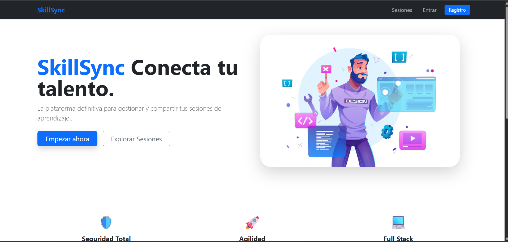
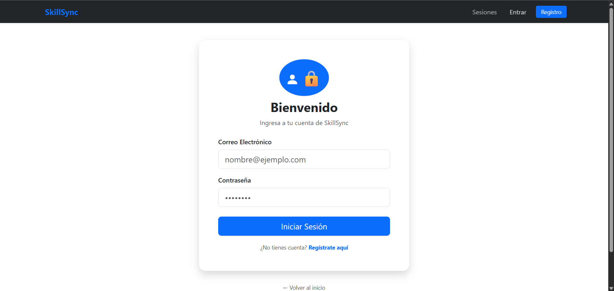
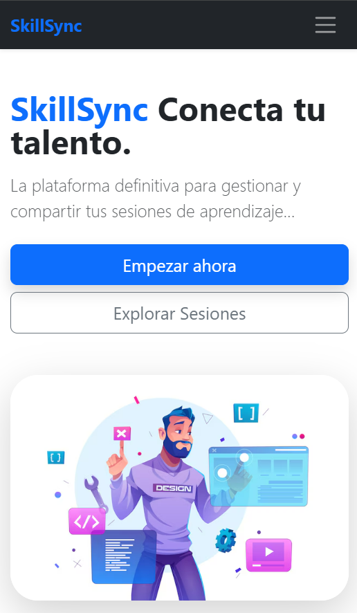

# 🚀 SkillSync: Plataforma de Gestión de Sesiones de Aprendizaje

**SkillSync** es una aplicación Full Stack diseñada para que desarrolladores y estudiantes compartan recursos, guías y sesiones de estudio de manera organizada y colaborativa.

## 🛠️ Tecnologías Utilizadas

### Frontend
* **React.js**: Biblioteca principal para la interfaz de usuario.
* **Bootstrap**: Framework para un diseño responsivo y profesional.
* **Axios**: Gestión de peticiones HTTP al backend.
* **React Router**: Navegación dinámica entre componentes.

### Backend
* **Node.js & Express**: Entorno de ejecución y framework para la API REST.
* **Sequelize**: ORM para la gestión de la base de datos relacional.
* **PostgreSQL (Neon)**: Base de datos en la nube.

### Seguridad (Security First 🛡️)
* **Hashing de Contraseñas**: Implementación de seguridad para la protección de usuarios.
* **Validación de Datos**: Restricciones de longitud y contenido para prevenir inyecciones y ataques de denegación de servicio (DoS).

---

## 🌟 Características Principales

- **Gestión de Sesiones**: CRUD completo (Crear, Leer, Actualizar y Eliminar) de sesiones de estudio.
- **Sistema de Comentarios**: Interacción en tiempo real entre usuarios en cada sesión.
- **Categorización**: Organización de recursos por tecnologías (HTML, CSS, JS, etc.).
- **Diseño UX/UI**: Interfaz limpia, centrada y optimizada para la lectura, con navegación fluida ("Botón Volver" y truncado de texto).
- **Favicon Personalizado**: Identidad visual única para el proyecto.

---

## 🏗️ Arquitectura del Proyecto

El proyecto sigue una estructura clara de separación de responsabilidades, ideal para escalabilidad:

- `/client`: Código fuente del frontend (React).
- `/server`: Lógica del backend, modelos de Sequelize y controladores.
- `/config`: Configuraciones de conexión a la base de datos Neon.

---

## 🚀 Instalación y Configuración

1. **Clona el repositorio:**
   ```bash
   git clone [https://github.com/keidis15/SkillSync.git](https://github.com/keidis15/SkillSync.git)

2- **Instala las dependencias (Servidor y Cliente):**

Bash
cd server && npm install
cd ../client && npm install

3- **Variables de Entorno:**
Crea un archivo .env en la carpeta /server con tus credenciales de Neon:

Fragmento de código
DATABASE_URL=tu_url_de_neon_aqui
PORT=3000

4- **Inicia el proyecto:**

Bash
# En la carpeta server
npm run dev

## 📸 Capturas de Pantalla

| Home Page | Detalle de Sesión |
| :---: | :---: |
|  |  | 

| Vista Mobile |
| :---: |
|  |

## Proyecto desplegado
https://skill-sync-self-zeta.vercel.app

## 🎓 Sobre la Autora
Desarrolladora Full Stack con formación en:

Estudiante Tecnico en Ciberseguridad.
Diplomado en Metodologías Ágiles.
Diplomado Diseño Web.
Bootcamp Full Stack JavaScript.
Certificación en Ciberseguridad (Santander).
